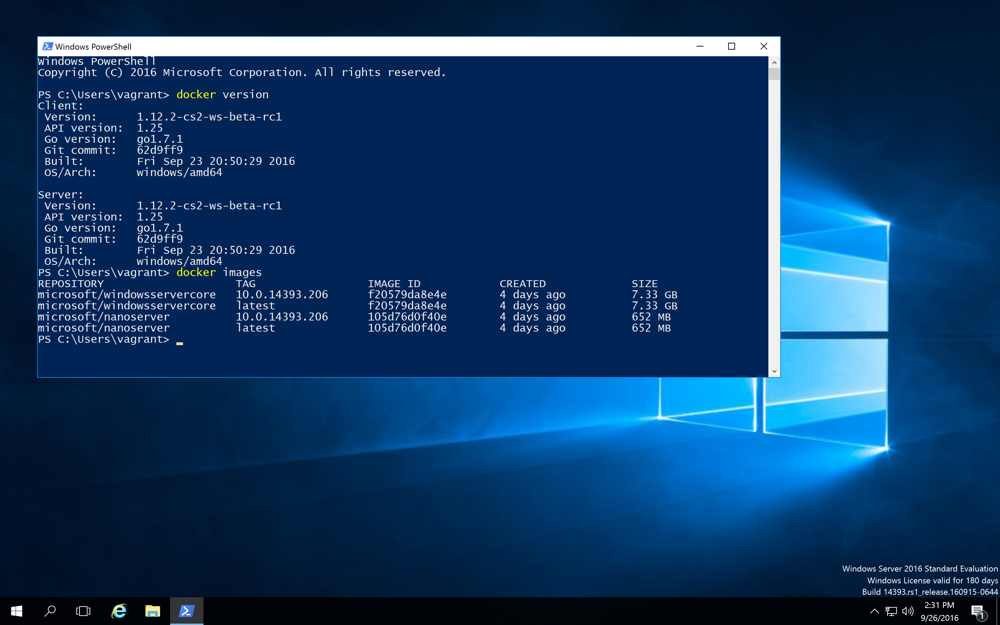
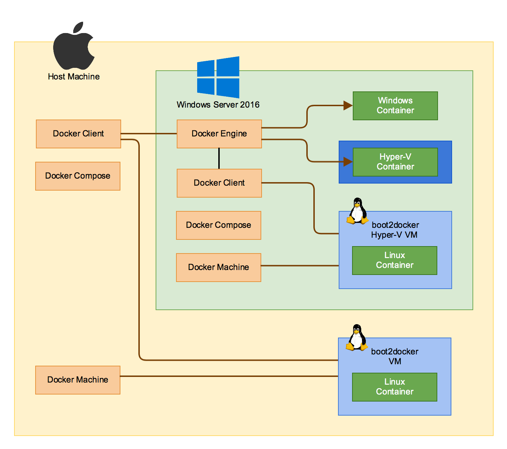

# docker-windows-box

This repo is a collection of various Vagrant environments to work with Windows Containers on a Windows Server 2016 or Windows 10 VM.

There are different Vagrantfiles for each scenario:

* `Vagrantfile` - Windows Server 2016 and Docker 17.03.0-ce
* [`nano/Vagrantfile`](nano/README.md) - Test setup to have Docker engine installed in a Windows Nanoserver VM
* [`swarm-demo/Vagrantfile`](swarm-demo/README.md) - some Windows Server 2016 VM's in classical Docker Swarm
* [`swarm-mode/Vagrantfile`](swarm-mode/README.md) - some Windows Server 2016 VM's in Docker Swarm-mode
* [`windows10/Vagrantfile`](windows10/README.md) - Windows 10 and Docker 17.03.0-ce natively installed (see [docker-windows-beta](https://github.com/StefanScherer/docker-windows-beta)  repo if you want to try Docker 4 Windows instead)

## Introduction

This repo has started with a single Vagrantfile that is explained below. As you can see there are several interesting setups here as well in the sub folders.

Have a look at my blog posts how to [Setup a local Windows 2016 TP5 Docker VM](https://stefanscherer.github.io/setup-local-windows-2016-tp5-docker-vm/) and [Adding Hyper-V support to 2016 TP5 Docker VM](https://stefanscherer.github.io/adding-hyper-v-support-to-2016-tp5-docker-vm/) for more details. I also can recommend a more up to date guide [Getting started with Windows Containers](http://glennsarti.github.io/blog/getting-started-with-windows-containers/) by [@glennsarti](https://github.com/glennsarti)



After provisioning the box has the following tools installed:

* Windows Server 2016 with Docker Engine 17.03.0-ce and client
* docker-machine 0.9.0
* docker-compose 1.10.0
* (Docker Tab completion for PowerShell (posh-docker))
* Chocolatey
* Git command line
* Git Tab completion for PowerShell (posh-git)
* SSH client

Optionally you can create a Hyper-V Docker Linux machine and have a multi architecture experience in one VM.

Tested with Vagrant 1.9.1, VMware Fusion Pro 8.5.3 on a MacBookPro with Retina display. The Vagrant box will be started in fullscreen mode also with Retina support.

You can learn and play a lot of scenarios with it:



Future work will be a Docker Swarm with both Linux and Windows Docker Engines...

## Get the base box

First register to [evaluate Windows 2016](https://www.microsoft.com/evalcenter/evaluate-windows-server-2016), but you don't need to download the ISO manually.

For the next step you need [Packer](https://packer.io). You have several ways how to install it. The easiest way is to install it via [Homebrew](http://brew.sh/). After you have installed Homebrew. Run the following command when you installed Homebrew:
```bash
brew install packer
```
If you don't have the Vagrant `windows_2016_docker` base box you need to create it first with [Packer](https://packer.io). See my [packer-windows](https://github.com/StefanScherer/packer-windows) repo to build the base box.

To build the base box you have to run these commands on your host machine:

```
git clone https://github.com/StefanScherer/packer-windows
cd packer-windows
packer build --only=vmware-iso windows_2016_docker.json
vagrant box add windows_2016_docker windows_2016_docker_vmware.box
```

## Spin up the box

To start the VM with [Vagrant](https://vagrantup.com) run this command

```bash
vagrant up
```

You only have to logout and login once to have the Docker tools in user vagrant's PATH.

## Create some Windows Docker Container images

You may clone my [dockerfiles-windows](https://github.com/StefanScherer/dockerfiles-windows) repo and create some container images.

```
git clone https://github.com/StefanScherer/dockerfiles-windows
cd dockerfiles-windows
cd node
.\build.bat
```

## Test the nightly Windows Docker Engine

You can update the Docker Engine with the script

```
C:\update-container-host.ps1
```

This will stop the Docker service, download the nightly build from https://master.dockerproject.org and restart the service.

## Create a Linux Docker machine in Hyper-V

If you want to try out multi architecture you also use `docker-machine` to create a Linux Docker Engine running in Hyper-V.
I have prepared a script that will set up everything as there are some known issues.

```
C:\vagrant\scripts\create-hyperv-linux-docker-machine.ps1
```

This PowerShell script creates a Docker machine and updates Docker Engine to the latest so that the Windows Docker client is able to communicate with the Linux Docker Engine.

### Use the Linux Docker machine

Open a PowerShell terminal as an administrator and select the Linux Docker machine with

```
docker-machine env --shell powershell | iex
```

Now run your first busybox container with

```
docker run -it busybox uname -a
```

## Windows Docker Swarm demo

See subdirectory [swarm-demo](swarm-demo/README.md)

## Use Vagrant to control your box

From your host control your Vagrant box with the usual Vagrant workflow:

* vagrant up
* vagrant halt
* vagrant destroy -f
* vagrant snap take
* vagrant snap rollback
* ...

Writing the installation script for the Hyper-V Docker machine the snapshot functions helped me a lot to test the script again and again.
