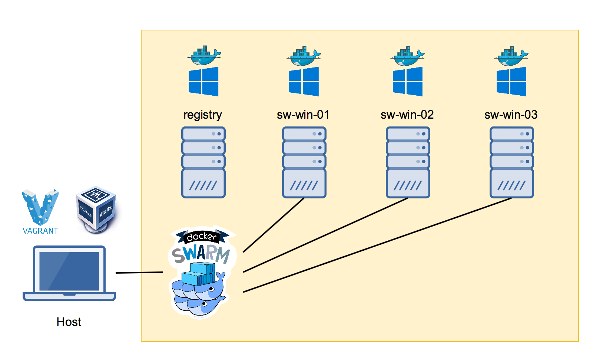
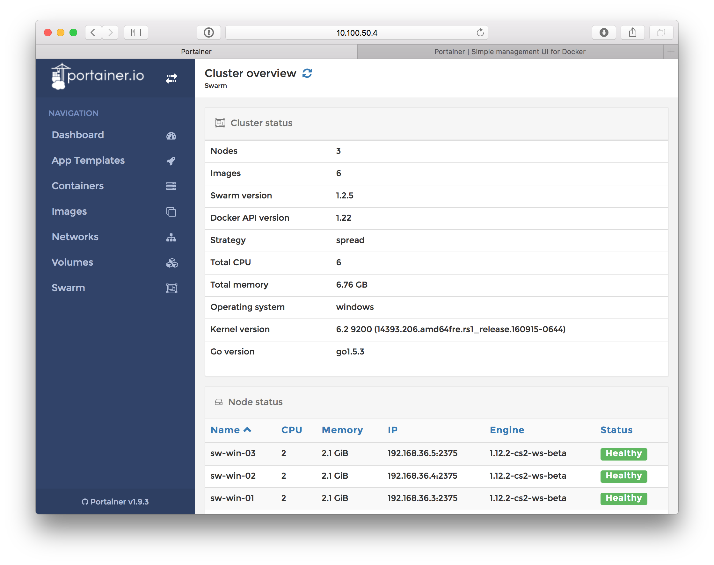

# Windows Docker Swarm demo

This is a local setup using Vagrant with VirtualBox to demonstrate a Windows Docker Swarm with a private (insecure) registry. This work was done for the blog post [Run a local Windows Docker Swarm](https://stefanscherer.github.io/build-your-local-windows-docker-swarm/). In the meantime the setup is updated to run the registry and swarm master on Windows as well.



## Vagrant boxes

There are four VM's with the following internal network and IP addresses:

| VM        | IP address   | Memory |
|-----------|--------------|--------|
| registry  | 192.168.36.2 | 2GB    |
| sw-win-01 | 192.168.36.3 | 2GB    |
| sw-win-02 | 192.168.36.4 | 2GB    |
| sw-win-03 | 192.168.36.5 | 2GB    |
| sw-lin-01 | 192.168.36.6 | 2GB    |

Depending on your host's memory you can spin up one or more Windows Server VM's.

### registry

A Windows Server 2016 machine with Docker and two containers running:

1. The [swarm](https://github.com/StefanScherer/dockerfiles-windows/tree/master/swarm) manager using a token in `config/swarm-token`
2. A [registry](https://hub.docker.com/r/sixeyed/registry/) using the `registry-v2` folder on your host to store the Docker images

Notice: The registry inside a Windows Container does only work with a custom
version of Go.

### sw-win-01 ...

The Windows Server 2016 machines that spin up a Swarm container to join the Docker Swarm.
The Docker Engine has connection to the insecure registry running at `registry:5000`.

## Create the boxes

You need Vagrant, VirtualBox and the [windows_2016_docker](https://github.com/StefanScherer/packer-windows) Vagrant box on your host.
This demo is tested on OSX with VirtualBox 5.0.26.

First create a new swarm token and overwrite the file `config/swarm-token`.
Then just run

```
vagrant up --provider virtualbox
```

and all the four VM's will be created.

## Registry storage

The storage of the private Docker Registry will be in the `registry-v2/docker` directory. On each Windows machine the Docker image `stefanscherer/swarm-windows:1.2.5` will be pulled.

It is save to destroy all the VM's as your Docker images are stored on your host.
Just recreate the registry and one of the Windows Servers and you can pull your own images again.

## Use the Windows Docker swarm

Connect from your host to the Swarm manager which runs in the `registry` VM with the IP address `192.168.36.100`.

```
PS C:\> docker -H registry:3375 info
Containers: 4
 Running: 4
 Paused: 0
 Stopped: 0
Images: 7
Server Version: swarm/1.2.5
Role: primary
Strategy: spread
Filters: health, port, containerslots, dependency, affinity, constraint
Nodes: 4
 sw-lin-01: 192.168.36.201:2375
  └ ID: QJRM:DNTF:T5Z6:EVFX:XTRE:OFTL:3JYJ:Y4NH:HNQR:UJYG:L4KL:WPBJ
  └ Status: Healthy
  └ Containers: 1 (1 Running, 0 Paused, 0 Stopped)
  └ Reserved CPUs: 0 / 2
  └ Reserved Memory: 0 B / 2.051 GiB
  └ Labels: kernelversion=4.4.0-38-generic, operatingsystem=Ubuntu 16.04.1 LTS, storagedriver=aufs
  └ UpdatedAt: 2016-10-09T13:49:34Z
  └ ServerVersion: 1.12.1
 sw-win-01: 192.168.36.101:2375
  └ ID: LYQ3:6MSS:HULY:6BR3:YH3J:UZFG:QLDL:7PL5:BKFD:YZPI:IGT3:WKXL
  └ Status: Healthy
  └ Containers: 1 (1 Running, 0 Paused, 0 Stopped)
  └ Reserved CPUs: 0 / 2
  └ Reserved Memory: 0 B / 2.1 GiB
  └ Labels: kernelversion=10.0 14393 (14393.206.amd64fre.rs1_release.160915-0644), operatingsystem=Windows Server 2016 Standard Evaluation, storagedriver=windowsfilter
  └ UpdatedAt: 2016-10-09T13:49:27Z
  └ ServerVersion: 1.12.2-cs2-ws-beta-rc1
 sw-win-02: 192.168.36.102:2375
  └ ID: ZOLM:NV32:ITYU:B7EU:ER2U:BMSO:IMDG:RHDW:NACR:OOFH:7JQ5:TLC2
  └ Status: Healthy
  └ Containers: 1 (1 Running, 0 Paused, 0 Stopped)
  └ Reserved CPUs: 0 / 2
  └ Reserved Memory: 0 B / 2.1 GiB
  └ Labels: kernelversion=10.0 14393 (14393.206.amd64fre.rs1_release.160915-0644), operatingsystem=Windows Server 2016 Standard Evaluation, storagedriver=windowsfilter
  └ UpdatedAt: 2016-10-09T13:48:56Z
  └ ServerVersion: 1.12.2-cs2-ws-beta-rc1
 sw-win-03: 192.168.36.103:2375
  └ ID: LCIU:CBB6:EQEW:AD25:CVBR:Z7GE:ODON:6DFZ:DSTR:GAKE:5DRE:IJ73
  └ Status: Healthy
  └ Containers: 1 (1 Running, 0 Paused, 0 Stopped)
  └ Reserved CPUs: 0 / 2
  └ Reserved Memory: 0 B / 2.1 GiB
  └ Labels: kernelversion=10.0 14393 (14393.206.amd64fre.rs1_release.160915-0644), operatingsystem=Windows Server 2016 Standard Evaluation, storagedriver=windowsfilter
  └ UpdatedAt: 2016-10-09T13:49:22Z
  └ ServerVersion: 1.12.2-cs2-ws-beta-rc1
Plugins:
 Volume:
 Network:
Swarm:
 NodeID:
 Is Manager: false
 Node Address:
Kernel Version: 6.2 9200 (14393.206.amd64fre.rs1_release.160915-0644)
Operating System: windows
Architecture: amd64
CPUs: 8
Total Memory: 8.35 GiB
Name: 01d0ea601a29
Docker Root Dir:
Debug Mode (client): false
Debug Mode (server): false
WARNING: No kernel memory limit support
Live Restore Enabled: false
```

Now we take a look at the images we have. Both a Windows swarm and Linux swarm image is there.

```
PS C:\> $env:DOCKER_HOST="tcp://registry:3375"
PS C:\> docker images
REPOSITORY                    TAG                 IMAGE ID            CREATED             SIZE
stefanscherer/swarm-windows   1.2.5               857fd9043059        12 days ago         7.36 GB
microsoft/windowsservercore   10.0.14393.206      f20579da8e4e        2 weeks ago         7.33 GB
microsoft/windowsservercore   latest              f20579da8e4e        2 weeks ago         7.33 GB
swarm                         1.2.5               942fd5fd357e        7 weeks ago         19.5 MB
```

## Run a Linux container

To run a Linux container in our multi OS swarm we have to use [constraints](https://docs.docker.com/swarm/scheduler/filter/).

The easiest label is the `storagedriver` as Windows only has `windowsfilter` as possible value.

So to spin up a Linux container avoiding all Windows swarm nodes we use the constraint `storagedriver!=windowsfilter`.

```
PS C:\> docker -H registry:3375 run -e constraint:storagedriver!=windowsfilter -d nginx
a7ba5d1386387c2b1be94a936016850171be13dcf92db759695c1b0e4f51cb61
PS C:\> docker ps
CONTAINER ID        IMAGE                               COMMAND                   CREATED             STATUS              PORTS               NAMES
a7ba5d138638        nginx                               "nginx -g 'daemon ..."    4 seconds ago       Up 3 seconds        80/tcp, 443/tcp     sw-lin-01/happy_hypatia
757d92b05f51        stefanscherer/swarm-windows:1.2.5   "\\swarm.exe join -..."   18 minutes ago      Up 18 minutes                           sw-win-03/evil_khorana
c64e46706988        stefanscherer/swarm-windows:1.2.5   "\\swarm.exe join -..."   45 minutes ago      Up 45 minutes                           sw-win-02/romantic_yalow
a432ef9c9465        stefanscherer/swarm-windows:1.2.5   "\\swarm.exe join -..."   About an hour ago   Up About an hour                        sw-win-01/nostalgic_newton
```

And as you can see the `nginx` container is runnin in the  `sw-lin-01` node.

## Run a Windows container

A similar constraint can be used to run Windows containers only on Windows nodes.

```
PS C:\> docker -H registry:3375 run -e constraint:storagedriver==windowsfilter -d microsoft/iis
8a177ff5c2615524c75030369e394d64ea7d00f3c8ab3214bd00805ec0cd224f
PS C:\> docker ps
CONTAINER ID        IMAGE                               COMMAND                   CREATED             STATUS              PORTS               NAMES
8a177ff5c261        microsoft/iis                       "C:\\ServiceMonitor..."   2 minutes ago       Up 2 minutes                            sw-win-01/elastic_allen
a7ba5d138638        nginx                               "nginx -g 'daemon ..."    4 minutes ago       Up 4 minutes        80/tcp, 443/tcp     sw-lin-01/happy_hypatia
757d92b05f51        stefanscherer/swarm-windows:1.2.5   "\\swarm.exe join -..."   23 minutes ago      Up 23 minutes                           sw-win-03/evil_khorana
c64e46706988        stefanscherer/swarm-windows:1.2.5   "\\swarm.exe join -..."   49 minutes ago      Up 49 minutes                           sw-win-02/romantic_yalow
a432ef9c9465        stefanscherer/swarm-windows:1.2.5   "\\swarm.exe join -..."   About an hour ago   Up About an hour                        sw-win-01/nostalgic_newton
```

## Manage Swarm with Portainer UI

I've added another running [portainer](http://portainer.io) in a Windows container on the registry machine. The `portainer` container talks to the `swarm-manager` container and offers its UI on port 9000 on the host of the registry machine.


