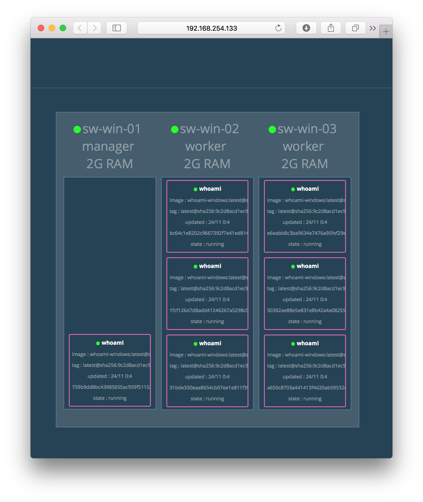
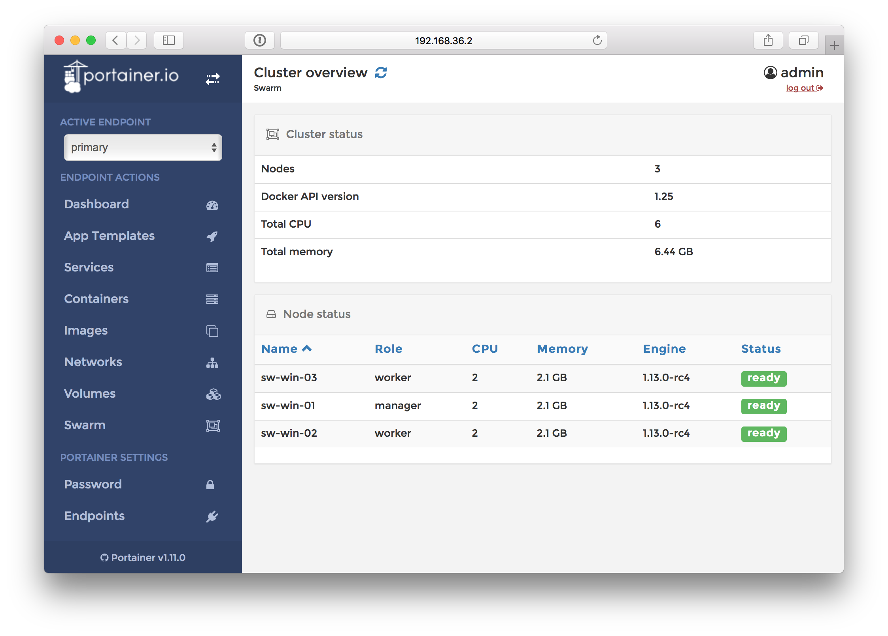

# Windows Docker swarm-mode

This is a local setup using Vagrant with VMware Fusion to demonstrate a Windows Docker swarm-mode.

## Vagrant boxes

There are three VM's with the following internal network and IP addresses:

| VM        | IP address   | Memory |
|-----------|--------------|--------|
| sw-win-01 | 192.168.36.2 | 2GB    |
| sw-win-02 | 192.168.36.3 | 2GB    |
| sw-win-03 | 192.168.36.4 | 2GB    |

Depending on your host's memory you can spin up one or more Windows Server VM's.

## Swarm Manager

The `sw-win-01` is the Swarm manager.

## Swarm worker

The `sw-win-02` and `sw-win-03` are Swarm workers.


## Example usage

Open a PowerShell window in the `sw-win-01` machine and create a service

```
PS C:\> docker service create --name=whoami stefanscherer/whoami-windows:latest
```

Check the service

```
PS C:\> docker service ls
ID            NAME    MODE        REPLICAS  IMAGE
eptkxbn1gce5  whoami  replicated  1/1       stefanscherer/whoami-windows:latest
```

Then scale up the service

```
PS C:\> docker service scale whoami=10
whoami scaled to 10
PS C:\> docker service ls
ID            NAME    MODE        REPLICAS  IMAGE
eptkxbn1gce5  whoami  replicated  6/10      stefanscherer/whoami-windows:latest
PS C:\> docker service ls
ID            NAME    MODE        REPLICAS  IMAGE
eptkxbn1gce5  whoami  replicated  6/10      stefanscherer/whoami-windows:latest
PS C:\> docker service ls
ID            NAME    MODE        REPLICAS  IMAGE
eptkxbn1gce5  whoami  replicated  10/10     stefanscherer/whoami-windows:latest
```

## Visualizer

Open a PowerShell window on the `sw-win-01` machine and run the script

```
C:\vagrant\scripts\run-visualizer.ps1
```

Now open a browser to see the visualizer UI. I use the IP address of the manager VM and open a browser on my host machine.



## Portainer

Open a PowerShell window on the `sw-win-01` machine and run the script

```
C:\vagrant\scripts\run-portainer.ps1
```

Now open a browser to see the Portainer UI. I use my host machine an the IP address 192.168.36.2



With both Visualizer and Portainer you could demonstrate scaling services


